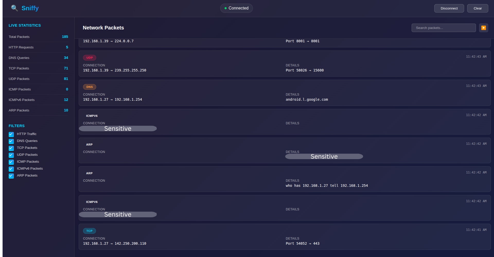
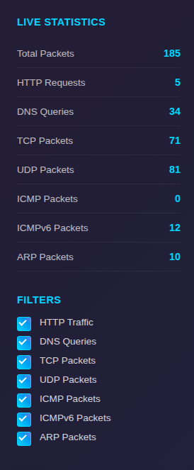
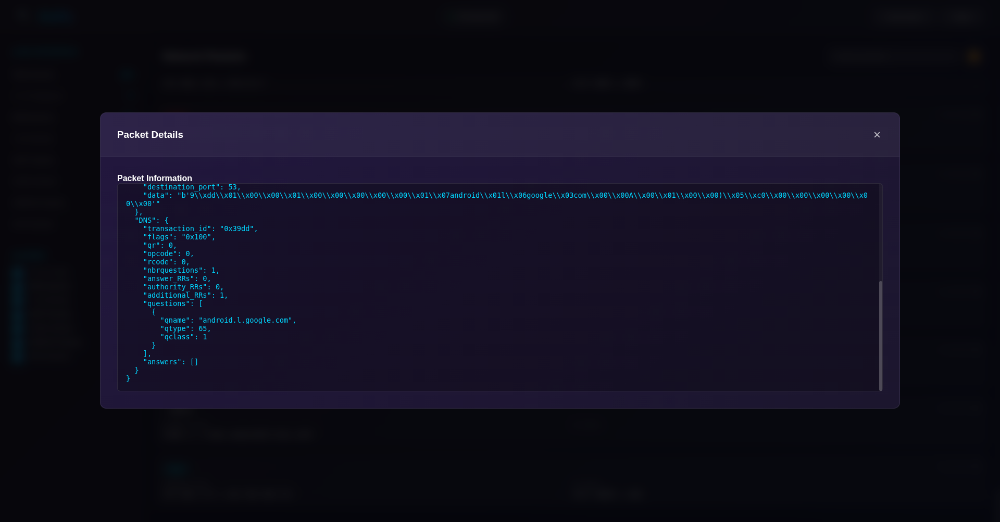

# SNIFFY

A lightweight packet sniffer on LINUX that enables you to monitor incoming traffic on a given interface. This program works by capturing raw packets in binary form using Sockets, then parsing that packet from scratch determining the type, the headers, and actual DATA.

[!Important]
This is a Linux based project, A windows version could be included in the future
**Docker Engine is required** to run the backend.

## Key Features

- Captures packets on a given network interface
- Currently supports Ethernet, IPv4, TCP, UDP, ICMP, ICMPv6, DNS, HTTP, ARP, DHCP
- Filters packets according to the desired protocols
- Provides additional detailed information about each packet
- Easy to extend: add your own protocol modules
- CLI interface for quick inspection
- **Dockerized Backend:** Isolated and clean environment for packet capture.

## Dependencies
- Node.js & npm
- Docker engine & Docker compose

## Installation

1. Clone the repo to your local machine
```bash
git clone https://github.com/BadrELAFI/Sniffy.git
cd Sniffy
```
2. Configure docker Permissions
```bash
sudo usermod -aG docker $USER
```
[!CAUTION] You must log out and log back in (or restart your computer) for this change to take effect. If you skip this, the app will fail to start the backend.

3. install dependencies

```bash
cd src/frontend
npm install
```
3. Run program

```bash
cd src/frontend
npm start
```
[!CAUTION]
If the program refuses to run after this installation, please try to install any requirements that the system demands

## DEMO

### Main Screen


### SideBar


### Packet Info


## Contributing

Pull requests are welcome. For major changes, please open an issue first
to discuss what you would like to change.

## License

[MIT](https://choosealicense.com/licenses/mit/)
